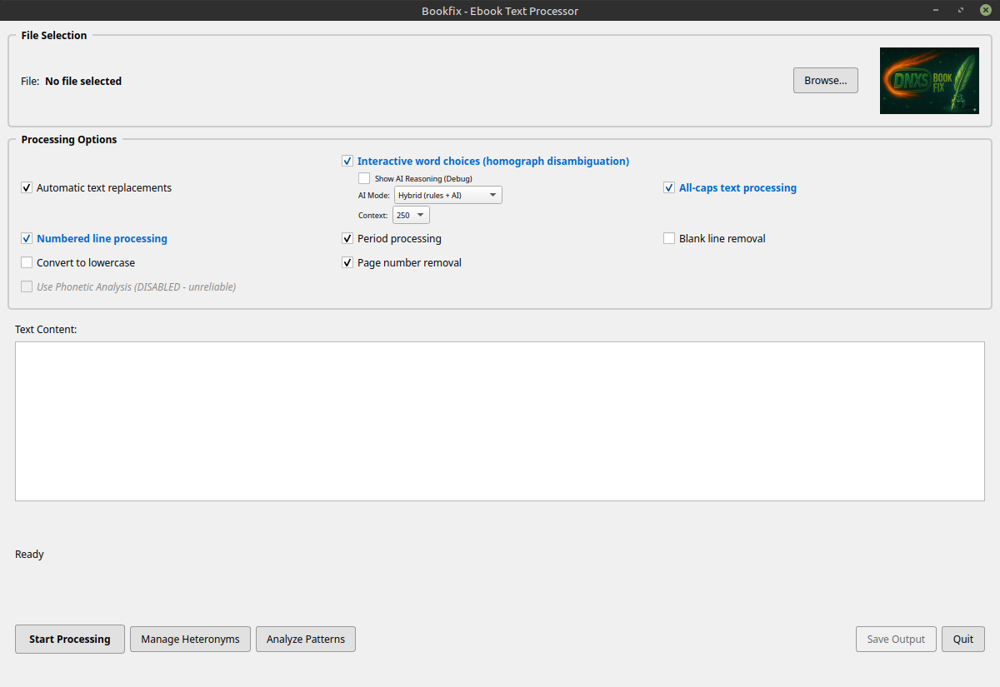

# BookFix — Ebook Text Processor for TTS Preparation

A modular PyQt5 desktop application that cleans up ebook text for text-to-speech (TTS) systems. BookFix combines automatic rule-based transformations with interactive AI-assisted review for ambiguous cases — so the spoken output sounds natural, with proper pronunciation of numbers, abbreviations, homographs, and capitalized words.

## Overview

Plain ebook text often confuses TTS engines: "Dr." gets read as "Doctor" or "Drive" depending on context, "1984" might be read as "one thousand nine hundred eighty-four" instead of "nineteen eighty-four", and ALL CAPS gets shouted. BookFix lets you process a text file through a configurable pipeline that fixes these issues either automatically (deterministic rules) or interactively (you review and approve each ambiguous case).

The application uses spaCy NLP, a weighted scoring engine for homograph disambiguation, and optional integration with AI providers (Gemini, OpenAI, Claude, Ollama) for context-aware decisions on hard cases.

## Features

All features below correspond to checkboxes and buttons on the main GUI.

The main GUI provides a browse button allowing the user to browse their system for the input text.

The main GUI provides eight functions with corresponding checkboxes.  Only check boxes which are selected will run when processing is started.




"Automatic Replacements"   process a list stored in the data/replace.txt file.   This file contains entries to do a direct replacement of an original word with a changed word.  
regex:\bMrs\. -> Misses  or literal:circiuts -> sirkits will find every instance of Mrs. and replace it with Misses or circuits with sirkits.  

"Convert to Lowercase"  converts all text in the file to the lowercase.  unchecked by default.

"Period Processing" Converts C.I.A. to CIA

"Page Number Removal" Find numbers on a line by themselves with no other text.  It assumes they are page numbers and will delete them.

"Blank Line Removal" removes all blank lines in the text.  

"Number line Processing "  finds all numerals over three digits in the text.  Rules in AI are run against those digits in a review window opens, allowing the user to further process each entry. See below for description of review window

"Interactive Word Choices" is the homograph processor.  Binds all homographs from the choices.json file and runs rules and AI. Against each word, then opens a review window allowing the user to process each proposed change.  See below for a description of review window.

"All-cCaps Text Processing" For its words or characters in a string that are all in CAPS. runs rules and AI against all found instances and opens a review window allowing the user to further process results.  also identifies potential Roman numerals in the review window for further processing.  See below for review window description.

- ### Action buttons

- **Start Processing** — Runs all enabled automatic processors in sequence, then launches the interactive review windows for any enabled interactive processors. only processes with a check in the corresponding box will be run.  This allows the user to choose which processes that run against the file.  Right clicking on a single check box will uncheck all other boxes and leave the selected one checked.

- **Manage Heteronyms** — Opens a dictionary editor for `data/choices.json`, the homograph definitions used by the disambiguation engine.

- **Analyze Patterns** — Pattern analysis tool for inspecting the text and processor decisions.  Currently Not in use.

- **Save Output** — Writes the fully processed text to a file (enabled after processing completes).  Once all processing is complete, press this button to save your altered output.  By default it saves to the original directory and file name with _output Appended to the end of the file name.

- **Quit** — Exit the application.

### Interactive review processors (you confirm each change)

- **Interactive word choices (homograph disambiguation)** — Identifies homographs (e.g., "lead" the metal vs. "lead" the verb, "bow" the weapon vs. "bow" the gesture) and presents each one with context for you to choose the correct pronunciation. Backed by spaCy `en_core_web_md` and a weighted scoring engine in `bookfix/scoring_engine.py`.
  
  *   7 buttons give control over all options
    
    1 Accept button accepts the proposed change.
    
    2 Fip button flips the choice from the proposed change to the alternate.
    
    3 ALL button  applies the proposed change to all instances of that word in the text.  used with extreme caution as a homograph has two choices of spelling. This button will apply the proposed choice to all instances of that word in the text.
    
    4 Add Replace button opens a pop-up window with context words surrounding the homograph. knight bowed before -> knight boughed before the homograph is bowed.  This exact phrase will be added to a file.  This file will be processed prior to rules or AI running It's a straight replacement so every instance of knight bowed before will be replaced with knight boughed before prior to processing.  This allows the user to add phrases where the homograph will always be in one particular form which results in a smaller review sample in shorter processing time.
    
    5 Edit button opens an edit window allowing the user to change the spelling or add anything before or after the text. Whatever is typed into the edit window will replace that single instance of the word in the output text.
    
    6 Add Skip button Operates in a similar manner to add replace button.  opens a pop-up window with homograph and context which allows the user to add a phrase to a skip file.  run pre-processing, this exact phrase will not be sent to the rules or AI and not appear in the review window.
    
    7 Flip All applies the flip process to all instances of that word in the text. used with extreme caution.
  
  Once all processing is done by the user the APPLY ONLY or SAVE LEARN buttons will save All the users choices.  Save Learn will save choices to ai learning file and be used in future weighted consideration by the rules/ai process.  If the user does not want to save the changes to the AI learning file, the Apply Only button applies the changes without altering the learning files.  This is useful for one-off changes or testing.

- **All-caps text processing** — Reviews every word in ALL CAPS in your text and lets you decide whether to keep it uppercase, lowercase it, or replace it. Includes sound-effect detection (e.g., "BOOM!", "CRASH!") with orange highlighting to mark them for special handling.
  
  * 8 buttons give control over all options.
    
    0 Skip button applies no changes, leaves, item, and original format.
    
    5 Skip All button skips every instance of the displayed item in the text.  
    
    1 Accept Button accepts the proposed change displayed.
    
    2 Lower Once button lower cases to displayed entry.
    
    3 Lower All button lowers all instances of that entry in the entire text.
    
    4 ADD To Cap Igoner adds the selected entry to a ignored list. It will no longer appear in the review window or be processed by rules and AI.
    
    6 Lower Add button adds the selected word to a list file.  This file will be consulted by the program before it processes a list and will automatically lowercase every instance of that word.
    
    8 Roman button is inactive unless the string of characters highlighted is a valid Roman numeral.  Pressing this button will automatically convert them to Roman numerals.  

- **Numbered line processing** — Detects numbers throughout the text and classifies each one by type — *General*, *Year*, *Code/ID*, *Currency*, *Time*, *Measure*, *Ordinal*, or *Range* — then formats them appropriately for TTS (e.g., "1984" → "nineteen eighty-four" as Year; "$5.99" → "five dollars and ninety-nine cents" as Currency). You confirm or reclassify each one in a review window with keyboard shortcuts 0–9.
  
  * 10 buttons give control over all options
    
    0 Skip Button
    
    1 General button converts 2025 to two thousand and twenty-five
    
    2 Year button converts 2025 to twenty twenty-five
    
    3 Code/ID button converst 2025 to 2 0 2 5 causing TTF to pronounce each individual number.
    
    4 Currency button converts 2025 to two thousand and twenty-five dollars.  Once the currency button is pressed, four separate buttons appear for currency type such as dollar, pound, etc.
    
    5 Time     button converts 2025, 20.25 20:25 to twenty twenty-five 
    
    6 Measure button converts 2025 to two thousand and twenty-five
    
    7 Ordinal button converts 2025 to two thousand and twenty-fifth
    
    8 Range button converts 2-3 to 2 to 3
    
    9 Flag buton adds convets 2025 to !!FLASH!! 2025.  The purpose of this button is to add a tag into the saved text that you can go back later and find easily.  This is added because sometimes something is visible in the context window surrounding the word that requires special attention and manual edit the flag button Give you an easy way to find this later on
  
  * As each item is selected, it is also displayed in the Edit window.  This allows the user to make any special changes that they want to the number such as prepending or appending words. the edit window also has a ALL button that will apply this exact change to every instance of the item in the process text.

## Installation

BookFix requires Python **3.10, 3.11, or 3.12**. It does **not** work on Python 3.13+ because some pinned dependencies (pygame, torch) don't have pre-built wheels for those versions.

### Linux / macOS

```bash
git clone <your-repo-url>
cd BookFix
./install.sh
```

### Windows

```cmd
git clone <your-repo-url>
cd BookFix
install.bat
```

What the installer does:

- Creates a Python virtual environment in `venv/`
- (Windows) Installs Microsoft Visual C++ Redistributable 2022 if missing
- Installs CPU-only PyTorch (no GPU/CUDA required)
- Installs all dependencies including PyQt5, spaCy, num2words
- Downloads the spaCy language models `en_core_web_trf` and `en_core_web_md`
- Writes a summary of all install steps to `install_log.txt`

If anything fails, check `install_log.txt` for which step failed.

## Running

### Linux / macOS

```bash
./run.sh
```

### Windows

Double-click `run.bat`, or from a CMD prompt:

```cmd
run.bat
```

The launcher activates the venv and starts the main application window.

## Project Structure

```
BookFix/
├── main.py                      # Application entry point
├── bookfix/                     # Main package
│   ├── gui.py                   # PyQt5 main window
│   ├── pipeline.py              # Automatic processing orchestrator
│   ├── context.py               # BookfixContext (central data structure)
│   ├── scoring_engine.py        # Weighted homograph scoring
│   ├── lexicon_loader.py        # Loads data/choices.json
│   ├── processors/              # All processing modules
│   ├── ai/                      # AI service + review dialogs
│   └── widgets/                 # Custom Qt widgets
├── data/                        # Configuration files
│   ├── choices.json             # Homograph definitions
│   ├── replace.txt              # Find/replace rules
│   ├── cap_ignore.txt           # Acronyms to keep capitalized
│   └── settings.txt             # Application settings
├── install.sh / install.bat     # Installer scripts
├── run.sh / run.bat             # Launcher scripts
└── LICENSE                      # Apache License 2.0
```

## License

Copyright 2026 Alan Householder

Licensed under the Apache License, Version 2.0. You may use, modify, and distribute this software (including for commercial purposes) provided you include the license notice and clearly mark any modifications. See the [`LICENSE`](LICENSE) file for the full text.
